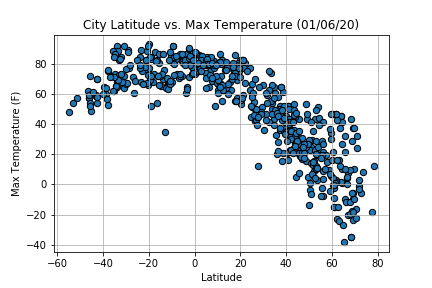
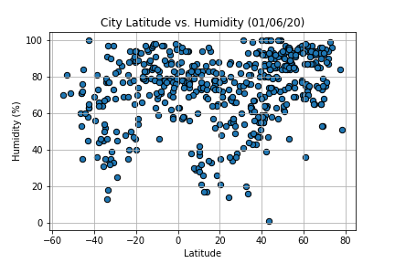
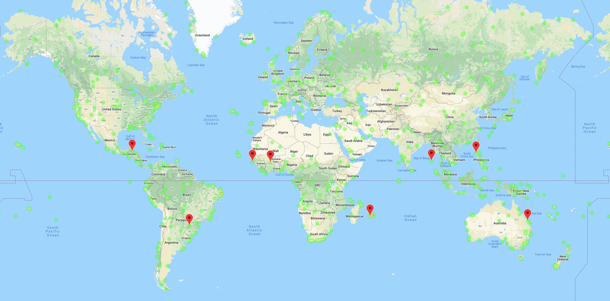

# Vacation API's
## Creator: Jack Harvey 

# Overview 
Analyzing weather data from an open weather source website to identify locations with specific weather trends that are input by the user.

* import matplotlib.pyplot as plt
* import pandas as pd
* import numpy as np
* import requests
* import time
* from scipy.stats import linregress
* import openweathermapy.core as ow
* from citipy import citipy
* import gmaps
* import os

# Running the Code
## Weather
The program will fist identify a list of over 600 randomly identified coordinates to ensure that a new cities are identified each time the program is run. Citipy is used to identify the city name and adds this to a list that will be used to identify a specific URL path to extract the weather data from. A CSV file is developed from this list including the City, Cloudiness, Country, Date, Humidity, Coordinates, Max Temp, Wind Speed.

This weather data is used to develope a scatter plot for all of the data found in each category.
 

## Vacation
This file used the output file developed to create a heat map of the world based on the current Humidity levels identified. Then the user will input their desired weather trends to create a new dataframe. These coordinates are then used by google's api url to identify the nearest hotel to the coordinates and adds this to the new dataframe.

# Sources
* Weather Data: 
  * https://openweathermap.org
* Google API:
  * https://maps.googleapis.com/maps/api/place/nearbysearch/json
